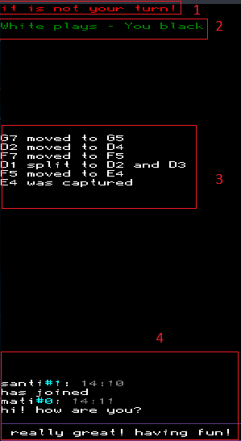

# Quantum Chess
## Taller de Programación I

**Matías Charrut** - 101137

**Santiago Lopez** - 100566

**Andrés Zambrano** - 105500

[Link al repositorio](https://github.com/santoi/quantum-chess)

## Ejecucion

### Dependencias
* Git
* Make
* CMake
* gcc
* g++
* SDL2 (paquetes ```libsdl2-dev```, ```libsdl2-mixer-dev```, ```libsdl2-ttf-dev```, ```libsdl2-image-dev```)
* Valgrind (solo si se desea correr con el mismo)

### Compilación
Para compilar, en una consola se debe clonar el resositorio utilizando
    
    git clone --recurse-submodules git@github.com:Santoi/quantum-chess

y luego ejecutar la compilación usando el script de bash.

    bash build.sh

### Ejecución del servidor
Para ejecutar el server, se debe ejecutar la siguiente linea, donde ```port``` es el puerto en el que se abrirá el server y ```config_file``` el archivo de configuración del tablero, el cual debe estar ubicado en ```boards/``` (solo el nombre del archivo, sin esta primera carpeta). Si no se explicita este último parámetro, se utilizara el archivo ```default.txt```.

    bash server.sh <port> [config_file]

### Ejecución del cliente

Para ejecutar el cliente, se debe ejecutar la siguiente linea, donde ```host``` es el host donde se encuentra corriendo el server y ```port``` el puerto.

    bash client.sh <host> <port>

### Ejecución de tests y valgrind

Para ejecutar los tests se debe correr la siguiente linea, para ello se debe tener instalado Valgrind.

    bash valtest.sh

Para ejecutar el servidor o el cliente con Valgrind, se ejecuta de la misma manera detallada en la sección anterior pero con los scripts

        bash valserver.sh <port> [config_file]
        bash valclient.sh <host> <port>

### Limpieza de build

Para limpiar la build, simplemente se debe borrar la carpeta ```build``` con

    rm -r build

## Como jugar

### Movimiento

Los movimientos que pueden realizar las piezas son iguales a los que se realizan en el ajedrez clásico (excepto por el peón pasado y la coronación). Al presionar clic izquierdo en una pieza se marcaran en azul todas las posiciones a los que se puede mover esa pieza.

Al dar un segundo clic en la posición deseada, si el movimiento es válido, la pieza se moverá al casillero indicado. Se indicará en el event log el movimiento realizado.

De no ser valido el movimiento, se indicará un error en la zona de log de errores.

<p align=center>
    
</p>

Si una pieza se mueve a un casillero del color contrario, al igual que en el ajedrez clásico, la pieza será capturada.

<p align=center>
    
</p>

### Fin del juego

A diferencia del ajedrez clásico, en el ajedrez cuántico no existe el jaque ni el jaque mate. Ya que por la aleatoriedad de las piezas superpuestas, un jaque mate es practicamente imposible. Por lo tanto el juego terminará cuando el rey de un bando sea capturado.

### Split

Las piezas pueden ser partidas y puestas en superposición, y pasará a ser una pieza cuántica. Una vez entrado en este modo, la pieza estará en dos o más lugares a la vez con cierta probabilidad. Esta probabilidad se divide por dos cada vez que se divide una pieza con un split.

Para realizar el split, se debe mantener presionada la tecla ```LEFT SHIFT``` y hacer clic izquierdo en una casilla. Se mostrarán en violeta las casillas a donde se puede hacer un split. Luego se debe clickear (ya no hace falta seguir apretando la tecla) y seleccionar el primer lugar al que se desea hacer el split, y luego al segundo. 


<p align=center>
    
</p>

Algunas consideraciones y limitaciones a la hora de hacer un split:
* No se puede hacer split a una casilla llena.
* No se puede hacer un split y comer a la vez.
* No se puede hacer un split y hacer una medición a la vez (ver [Medición](#medicion)).
* No se puede hacer un split y entrelazar a la vez (ver [Entrelazamiento](#entrelazamiento))


### Merge

Una pieza partida podrá ser reunida de nuevo mediante el movimiento merge. Una vez que se unan dos piezas, estas sumarán sus probabilidades resultando en una nueva pieza.

Para realizar el merge, se debe mantener presionada la tecla ```LEFT CTRL``` y hacer clic izquierdo en la pieza que se quiere mergear. Se mostrarán en marrón las casillas a donde se puede hacer un merge. Luego se debe clickear (ya no hace falta seguir apretando la tecla) y seleccionar la otra pieza con la que se quiere mergear. El color marrón cambiara a las casillas a las que ambas piezas pueden moverse. Un tercer clic en una casilla valida, efectuará el merge.

<p align=center>
    
</p>


Algunas consideraciones y limitaciones a la hora de hacer un merge:
* El merge se puede realizar a la casilla de algunas de las piezas involucradas, siempre que el movimiento para la otra sea posible.
* No se puede hacer un merge y comer a la vez.
* No se puede hacer un merge y hacer una medición a la vez (ver [Medición](#medicion)).
* No se puede hacer un merge y entrelazar a la vez (ver [Entrelazamiento](#entrelazamiento))
* Si existiese un entrelazamiento, y este se hubiera realizado luego de hacer el split que dividió a las piezas, este desaparecería (ver [Entrelazamiento](#entrelazamiento)).

<a name="medicion"></a>
### Medición

Cuando se intente mover una pieza a un casillero lleno, pueden ocurrir dos situaciones, que esté ocupado por una pieza propia o una pieza contraria.

Si ambas piezas son clásicas, se resuelve igual que en el ajedrez clásico, si son del mismo color, no se hace el movimiento, y si son de distinto color, se captura.

En cambio, si alguna de las dos piezas es cuántica, se produce una medición, es decir, se conocerá si la pieza estaba allí o no realmente. En el primer caso, las demas partes de esta pieza desaparecerán y la nueva pieza pasará a tener probabilidad 1. Si la pieza a la que se intenta mover es del mismo color (y efectivamente estaba allí), no se hará el movimiento, si en cambio era de distinto color, se comerá. 

En el caso de que la pieza no esté realmente allí, esta desaparecerá, y se propagarán probabilidades por las demás partes de las piezas.

En el siguiente caso, la torre mide a la reina contraria, y como la reina estaba allí, fue capturada.

<p align=center>
    
</p>

En el siguiente caso, el rey mide a la torre propia, y resulta que no estaba alli, por lo que se realiza el movimiento.

<p align=center>
    
</p>

Si hubiera piezas entrelazadas, estas también son medidas si corresponden.

<a name="entrelazamiento"></a>
### Entrelazamiento

Cuando se realiza un movimiento, podría ocurrir que en el camino de la pieza, se encuentre una pieza cuántica, de ocurrir esto, se partirá la pieza que se está moviendo y se producirá un entrelazamiento entre las piezas, con lo cual sus destinos quedan ligados.

A partir de aquí cuando, se mida una de las piezas entrelazadas, el destino de la otra también se definirá.

<p align=center>
    
</p>

Algunas consideraciones y limitaciones a la hora de entrelazar:
* No se puede entrelazar con más de una pieza a la vez.
* No se puede entrelazar dos veces la misma pieza.
* No se puede hacer split, measure o merge a la vez que se entrelaza.

### Visualización de piezas partidas y entrelazadas

Si se hace clic derecho en una pieza, se podra observar en verde cuales son las otras partes de la pieza, y en celeste con que piezas está entrelazada.

<p align=center>
    
</p>

### Enroque

El enroque permite mover en un mismo movimiento al rey y a una de las torres. Según que torre se utilize, se puede hacer:

* Enroque largo (en la imagen): se intercambian el rey y la torre de la izquierda, en este caso tienen que estar vacios los tres casilleros entre el rey y la torre. El rey queda en el casillero C1 (si se juega con blancas) y la torre en el casillero D1. 
* Enroque corto: se intercambian el rey y la torre de la derecha, en este caso tienen que estar vacios los dos casilleros entre el rey y la torre.  El rey queda en el casillero G1 (si se juega con blancas) y la torre en el casillero F1.

<p align=center>
    
</p>

Para hacer un enroque simplemente se debe hacer clic en la posición que el rey ocupará, cuando esté disponible.

Consideraciones y limitaciones a la hora de enrocar:
* No se puede enrocar si alguno de los dos casilleros que deben ocupar la torre y el rey, están ocupados (no se puede medir).
* Al igual que en el ajedrez clásico, tanto torre como rey no deben haberse movido nunca (aunque hayan vuelto al lugar).
* A diferencia del ajedrez clásico, como no existe el jaque, el rey puede estar siendo atacado, y las casillas de paso y finales pueden estar bajo ataque tambien.

Además, se pueden hacer movimientos de tipo cuantico mientras se enroca.

* Podría ocurrir que en el enroque largo, al lado de la torre haya una pieza cuantica, con lo cual, como no es un casillero donde quedará una pieza del enroque, y la pieza podría estar allí o no, se enlazará la torre y el rey con esta pieza.

<p align=center>
    
</p>

* Podría hacerse un split mientras se enroca, eligiendo en el split una posición correspondiente al enroque (o ambas). Al hacer esto, la torre (o las torres, si se hizo el split en ambos enroques) quedarán entrelazadas con el rey.

<p align=center>
    
</p>


### Logs y Chat

En la zona derecha de la pantalla, se pueden visualizar 4 secciones: el log de errores (1), el log de turnos (2), el log de movimientos (3) y el chat(4).


 <p align=center>
    
</p>


 1. El log de errores se muestra en rojo, cuando un movimiento no se haya podido completar por algún error del usuario (tal como un movimiento inválido, no es su turno, etcetera).
 2. El log de turnos se muestra en verde, e indica quien debe jugar.
 3. El log de movimientos detalla en vivo cuales fueron los últimos movimientos realizados en la partida y sus consecuencias.
 4. El chat permite conversar con los otros jugadores y observadores. Para utilizarlo se deberá hacer clic sobre la barra negra de la derecha, allí se podrá tipear. Los mensajes son enviados utilizando ```ENTER``` o automáticamente al llegar al final de la linea. Para voler al juego, solo se debe presionar sobre el tablero (este primer toque no activará ninguna casilla).


 <p align=center>
    
</p>


### Activación de musica y sonidos

La música puede ser activada y desactivada utilizando la tecla ```M```. Los efectos de sonidos pueden ser desactivados utilizando la telca ```N```.

### Cancelando movimientos

Todos los movimientos pueden ser cancelados con la tecla ```ESC```

## Archivo de configuración del tablero

El archivo de configuracion permite cargar tableros pre-definidos. Esto es para el server, por lo que un server inicializado con un archivo, lo usará para todas sus partidas.

 Los archivos de configuración deben ser guardados en texto plano en la carpeta ```boards/```.

Cada pieza debe ser colocada en una línea distinta, teniendo la siguiente forma:
    
    <CHESSMAN><POS_X><POS_Y><COLOR>

donde:

* ```CHESSMAN``` es un caracter que representa a la pieza que se coloca (este caracter es la inicial del nombre de la pieza en inglés, excepto para el caballo que es representado por ```H```).
* ```POS_X``` es la posición en x, caracter de A a H.
* ```POS_Y``` es la posicion en y, número de 1 a 8.
* ```COLOR``` es un caracter que representa el color de la pieza, ```W``` para blancas y ```B``` para negras.

Las lineas en blanco son ignoradas y se pueden insertar comentarios utilizando ```#``` como primer caracter de la linea. Todos los caracteres deben ser ingresados en mayúsculas.

Por ejemplo, si se carga un archivo como se muestra a continuación, se obtiene el siguiente tablero.

    # White chessmen
    TA1W
    KE1W
    PA2W
    PG5W

    # Black chessmen
    KE7B
    QC3B
    BF1B


<p align=center>
    
</p>