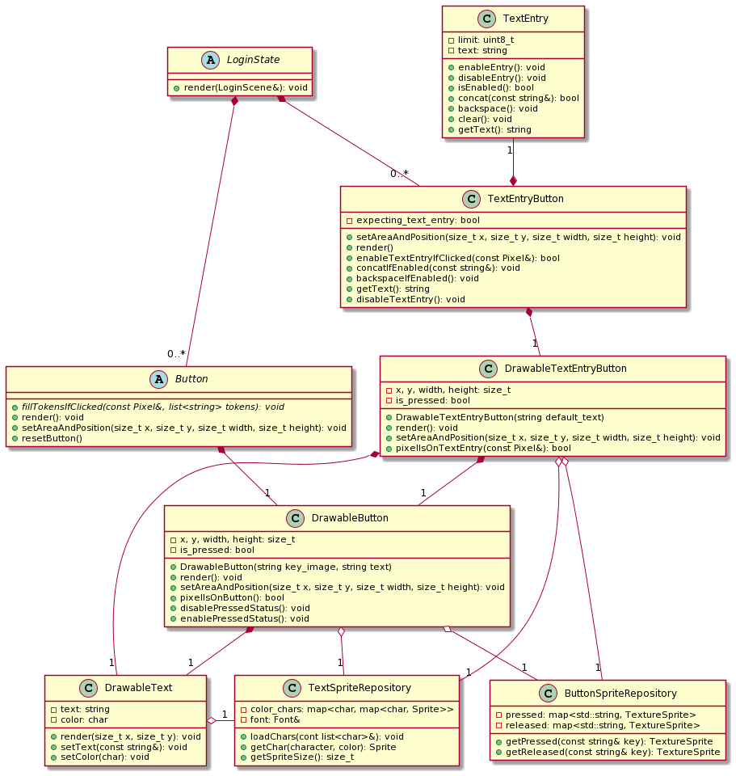

# Manual técnico de la pantalla de inicio (Login)

La pantalla de inicio de este programa, necesaria para cualquier juego de computadoras, es concebida con la filosofía de ser escalable, es decir, que agregar nuevas pantallas, distintos tipos de botones y otras características sea fácil y no requiera de un cambio sustancial en el diseño del mismo. 

Antes de mostrar los diagramas de clase y de secuencia, se procede primero a explicar los conceptos básicos que tiene el login.  Y es que incluso los juegos más sencillos necesitan de cierta configuración antes de comenzar a jugar. Este ajedrez no es la excepción: desde que el usuario ejecuta el cliente hasta que se une a una partida para propiamente jugar o espectar, este tendrá que navegar por una serie de pantallas (o estados) del login con el fin de: 

* Conectarse con el servidor.
* Proporcionar su nombre de usuario.
* Seleccionar la partida en la que quiere participar (o si se quiere crear una).
* Seleccionar el rol que el usuario quiere tomar (ser piezas blancas o negras según disponibilidad, o ser espectador).

Esta es información que el servidor necesita para poder asociar al cliente con una partida y con el rol que este escogió. 

### Estados de login 

Para cada uno de estos requerimientos pueden salir una pantalla cuya unión conforma el login del juego. Siguiendo, se puede tener que la primera pantalla que se le muestra al usuario sirva para que este proporcione la ip y el puerto del servidor. Después, otra para que este proporcione su nombre de usuario, lo mismo para seleccionar la partida en la que quiere participar y lo mismo para seleccionar el rol. 

Si cuando se comenzó a plantear el login desde cero se hubiera pensado "primero se hace la pantalla del ip y del puerto y después se agregan las otras pantallas", lo más probable es que el diseño final de todo el login hubiera sido un gran desastre. La idea fue entonces plantear seriamente la implementación, no solo de la pantalla de ip, sino de todas las posibles pantallas que se quisieran tener, en un diseño compacto que ayude a agregar no solo las pantallas que son necesarias (por ejemplo la de seleccionar la partida), sino también cualquier otra que por alguna razón pudiera querer añadirse.

Se podría decir que la palabra "pantalla" se refiere a la parte gráfica, más asociada a la gui. Para empezar a hablar en términos para realizar la implementación, se asocia a cada pantalla que ve el usuario con un "estado" del login. Así, la pantalla de la ip y del puerto está asociada con el estado 'no conectado al server', la pantalla de las partidas está asociada al estado 'seleccionando partida' y así sucesivamente. Si se plantea entonces que cada estado individual hereda de una clase madre Estado la magia del polimorfismo se asoma y el olor a un diseño escalable comienza a percibirse.

### Botones

Los botones son una parte escencial de cualquier login ya que es la manera en que el usuario se comunica con el programa. Cada botón tiene un objetivo y es erróneo pensar lo contrario: es distinto el botón "conectar" de la pantalla de ip (cuando se quiere intentar conectar al servidor) que el botón "seleccionar partida". No obstante si comparten una funcionalidadad clave: saben si fueron clickeados o no. Más allá de eso, la diferencia entre un botón y otro es:

* *Qué hace* un botón cuando es presionado.
* *Cómo y dónde* se muestra en pantalla un botón.

Esto tiene como consecuencia que el botón es un objeto que relaciona altamente lo que se muestra en pantalla (la gui) con la lógica del cliente (qué sucede en la secuencia del programa cuando el botón es presionado).

### Entradas de texto

En el diseño del programa, las entradas de texto son parecidos a los botones en el sentido de que tienen que saber dónde y cómo mostrarse por pantalla, además de saber si fueron clickeados o no por el usuario. El accionar sin embargo sí es distinto: el objeto de entrada de texto espera añadir texto (o una letra) al string que este almacena una vez a sido presionado.

No sería de mucha ayuda tener entradas de texto sueltas en una pantalla de login, que reciban texto y los vaya mostrando adecuadamente, si es que al final dichas entradas no son asociadas a un botón de los que se habló anteriormente: si existe el botón "Conectar" en la pantalla de ip y puerto con sus respectivas entradas de texto, se espera que cuando el botón se presione la información que se colocó en las entradas llegue de alguna forma al accionar del botón, para así poder usar dicha información para intentar conectarse al servidor.

Juntando las piezas expuestas, se cree conveniente la creación de 'Estados' de Login, cada uno conteniendo un conjunto de 'Botones' y 'Entradas de Texto' según los requerimientos de cada estado.

Dicho esto, se procede a explicar las porciones faltantes de la lógica de este Login.

### Objeto Login.

Este es posiblemente el objeto más sencillo: su única responsabilidad es recibir la ip y el puerto para poder conectarse al servidor, guardándo el socket creado, y comunicando al servidor los datos requeridos para participar en una partida (número de partida escogida, nombre de usuario y el rol escogido).

Este socket es el mismo que se usará posteriormente para recibir/enviar información al servidor respecto del juego, entonces cuando la etapa de Login termine, el objeto Login tiene que regresar por movimiento el socket que este almacena.

### Controlador de estados del Login.

Es inviable pensar que cada estado no está conectado con otro de alguna forma: todos forman parte de una imagen más grande. Intuitivamente esto es así, ya que uno como usuario espera que la pantalla de seleccionar partida venga después de haberse conectado al servidor, y que la pantalla de seleccionar rol venga después de haber seleccionado la partida. Esta lógica podría estar en cualquier parte del programa, sin embargo es importante que esta esté encapsulada en algún lugar. Se decidió tenerla en un objeto especial que se llama "Controlador de Estados". Esto es así porque de otra manera la responsabilidad de cambiar de estados y lo que esto conlleva estaría expuesta y no sería clara. Además, todos los estados comparten referencias a los mismos objetos (por ejemplo, no puede haber dos objetos Login ya que solo uno puede tener un socket válido), por lo tanto para crear un nuevo estado se necesita poder suministrar los objetos correspondientes.

Agregando, no se puede esperar que el usuario siempre va a proporcionar información correcta: si por ejemplo uno se encuentra en el estado de conectandose al servidor, puede ser que el usuario proporcione un ip y/o puertos no válidos. Es el controlador de estados quien se encarga de atajar este tipo de excepciones para mantener el login en un estado válido.

### Controlador de etapa de Login.

A lo largo de toda la etapa de login, siempre se hace lo mismo, independientemente del estado de este: se espera a un evento de tipo click (u otros), se revisa los botones y entradas de texto válidas según el estado, activándolos si es necesario, y se repite la misma iteración hasta que el servidor ya tenga los datos que este necesita. Para esto se creó el objeto "Controlador de Etapas" que hereda del objeto thread con la finalidad de después ser ejecutado en un solo hilo, como se explicará más adelante.

Ahora sí, se muestran los diagramas de clase:

Este diagrama de clases muestra como se relacionan las distintas clases del login. Se hace enfásis en que cuando el LoginHandlerThread (el controlador de etapas) le pide al LoginStateHandler (controlador de estados de login) hacer una tarea, este último siempre le delega la acción a su estado actual. Esto garantiza el uso de polimorfismo, simplificando enormemente la creación de una nueva pantalla o funcionalidad. Además facilita la lógica del controlador de etapas, ya que este se puede abstraer de cualquier estado actual: siempre hará las mismas iteraciones.

Este diagrama muestra como cada estado puede tener tanto una lista de botones como una lista de entrada de texto. Se anticipa además que tanto los botones como la entrada de texto tienen sus respectivos objetos drawables (dibujables) los cuales se encargan justamente de saber dibujar su clase correspondiente.

Se procede a mostrar un diagrama de secuencia al recibir un evento del tipo click izquierdo sobre el botón de conectar cuando el login se encuentra en el estado "Conectandose al Servidor".

El siguiente diagrama de secuencia muestra como se maneja un click "al aire" en cualquier estado del login. 

De nuevo se hace enfásis en que no importa el estado actual del login: siempre se actúa de la misma forma. Lo único que cambia de un estado a otro es la respuesta a los métodos fillActiveButtons(), fillActiveTextEntries() y processTokens(). 
A su vez, como los botones heredan de la clase Button, se pueden almacenar en una lista de botones para que la secuencia sea polimórfica. La diferencia entre un botón y otro entonces está en cómo implementan el método fillTokensIfClicked(). Esto hace que sea sencillo tener un estado con todos los botones que uno quiera imaginar.

Ahora bien, cuando un usuario interactua con un sistema informático, es probable que algo salga mal, ya sea por un error en el mismo sistema, o porque el usuario ingresó información no válida, o ambas. La pantalla de login es especialmente sencible al segundo caso: ¿Qué pasa si el usuario coloca un ip y/o puerto incorrecto? ¿Cómo responde el sistema cuando el usuario intenta escoger un rol no disponible? Cualquiera de estos casos son posibles y el programa no puede romperse si es que llega pasar alguno. Se procede entonces a mostrar, mediante un diagrama de secuencias, como se reacciona en el segundo caso.

### Escena del login

Una vez explicado las clases primordiales de la lógica del login, falta exponer cómo funciona la otra cara de la moneda, la que ve el usuario. Está claro que para cada estado del login hay una pantalla que el usuario ve y con la que interactúa. Se necesita entonces un objeto que tenga la responsabilidad de colocar, renderizar y mostrar por pantalla los botones y entradas de texto disponibles en un momento dado. Acá es donde entra el LoginScene, o escena del login. 

En una ejecución de programa normal, se le pide al LoginScene que muestre en pantalla. Pero, ¿cómo puede hacer esto? ¿Se guarda todos los botones que existen para todos los estados y los muestra? No puede ser: no tiene sentido que se muestre los botones de rol cuando
ni siquiera el login se encuentra conectado al servidor. ¿Se guarda entonces una serie de booleanos mediante los cuales decide cuál botón mostrar o no? Podría llegar a hacerse, pero la lógica se complicaría bastante: agregar una nueva pantalla sería tedioso, al igual que agregar nuevos botones. Sin embargo, lo que si se puede hacer es aprovechar la lógica que ya está implementada del controlador de estados de login, y los estados individuales de este. Cuando le pidan a la escena del login que renderice, lo único que tiene que hacer es comunicarse con el estado actual, y que dicho estado le diga a la escena qué es lo que hay que renderizar. De esta forma no hay duplicado de código respecto al manejo de pantallas de login, y la implementación termina siendo mucho más sencilla.

Ahora se muestra un diagrama de secuencia que muestra cómo se implementó lo planteado anteriormente en el código.

Con el objetivo de mostrar un caso en específico, se muestra cómo es esta secuencia cuando el login se encuentra en el estado SeleccionandoPartida.

### Botones y Entradas de Texto dibujables.

Como se dijo anteriormente, los botones y las entradas de texto tienen la particularidad de que tienen que saber mostrarse y también tienen que saber actuar en caso de un evento, por lo que participan activamente tanto en la gui como en la lógica del programa. Este último aspecto ya fue cubierto, ahora se procede a explicar *qué* sucede cuándo le piden a un botón/entrada de texto que se renderice. Para eso, primero se muestra el siguiente diagrama de clases:

Se muestra que las clases dibujables de botones y de entradas de texto tienen:

* Referencia a un repositorio de imagenes de botones
* Referencia a un repositorio de imagenes de texto. 
* Booleano que denota el estado del dibujable (si ha sido presionado o no)

Dicho esto se procede a explicar los detalles de cada uno, comenzando con los botones normales.

##### Botones dibujables.

Para crear un botón dibujable hay que suministrar las referencias a los repositorios antes mencionados. Además, se necesita la 'key' o la *clave* de la imagen que se quiere usar para dibujar dicho botón. Dicha clave es un string con el que se puede obtener las imagenes correspondientes del botón (una cuando este ha sido presionado y la otra para cuando no) del repositorio de imagenes de botones.

Para la creación también se necesita un string con la finalidad de ser mostrado encima del botón y el usuario pueda saber para qué sirve. Para manejar dicho texto la clase Botón utiliza un DrawableText (texto dibujable) la cual puede ser renderizada en una posición dada. En este punto, solo hace falta setearle el área y la posición al botón dibujable para poder convocar su método render y que la magia suceda.

#### Entradas de Texto dibujables.

Como se mostró en el diagrama, la clase DrawableTextEntry no solo comparte algunos atributos que el DrawableButton, ¡sino que además está compuesta por un DrawableButton! Esto se pensó así para aprovechar la funcionalidad que tiene dicha clase de tener dos estados: presionado y no presionado y también para usar la lógica que esta tiene para seleccionar imágenes. 

Otro atributo que recibe en el momento de su creación es el nombre de la entrada de texto. Este string sirve para ser mostrado cuando la entrada de texto no tenga texto a dibujar, y así el usuario sabe cuál es su funcionalidad. Una vez el usuario escribe para la entrada, este texto se va dibujando. En ambos casos el DrawableTextEntry usa su DrawableText para dibujar dichos textos.

### Excepciones

Antes de la etapa final de la documentación técnica, se procede a mostrar las distintas clases que lanzan y manejan excepciones.

## Manejo de hilos

Cuando se quiere un programa responsivo para el usuario se necesita hacer uso de hilos. En el caso de la pantalla de Login, dado la información que se ha mostrado a lo largo de este manual técnico se propone el uso de solo dos hilos: uno para renderizar y otro para manejar la interacción con el usuario, de la siguiente forma:

El objeto que está siendo accedido por ambos hilos es el LoginStateHandler, por lo que se utiliza un mutex en esta clase para evitar problemas a la hora de acceder al estado actual.

# Algo más que un Login

El login es necesario para que el usuario pueda interactuar con el programa cliente y este pueda comunicarse con el servidor, y ese era su objetivo inicial. Sin embargo, dado su diseño compacto y extensible, se vio la posibilidad de aprovechar el login que ya está implementado para crear nuevas funcionalidades que se piensan fundamentales en un juego en línea. Una de estas es la posibilidad de navegar por el juego: poder entrar en una partida y regresar a la pantalla de selección de partidas para volver a jugar, esto sin la necesidad de parar de ejecutar el programa, volver a ejecutarlo y volver a poner los datos de ip y puerto. 

Esto le da al usuario una libertad que antes no hubiera tenido. Para hacerlo, el constructor del LoginStateHandler recibe un booleano que denota si el Login se había conectado antes al server. Si este no es el caso (booleano == false) entonces se crea un controlador de estados (con estado actual ConnectingToServerState) tal como se mostró en la primera sección de este manual, y su ejecución no cambia.

Si el booleano == true, significa que el Login sí se había conectado antes al servidor, por lo que este almacena strings para ip y puerto correctos. El login entonces se crea con el estado ChooseToKeepPlayingState, donde al usuario se le presentarán dos botones: "Sí" si este quiere seguir jugando, y "No" si no. Se presenta un diagrama de secuencias explicando estos casos.

Tal como se muestra: si el usuario quisiera volver a jugar, el controlador de estados pasa al SelectingMatchState, y pasa la misma secuencia de antes. Caso contrario, se guarda el estado que el cliente no quiere jugar y que se puede cerrar el programa. Ahora se muestra un diagrama de flujo de todo el programa.

