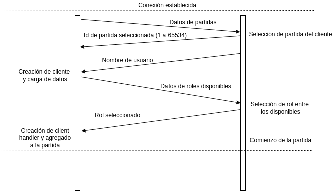
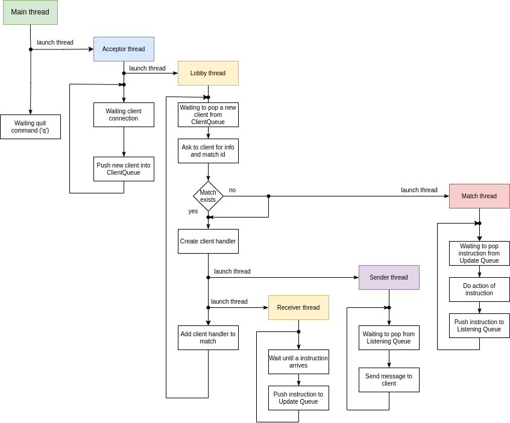

# Quantum Chess: Manual Técnico Server

En este programa, el server es el encargado de conectar a los clientes entre si, creando partidas y ocupandose de conectar a los clientes a ellas. Además, se encarga de procesar toda la lógica de juego, quitando esta responsabilidad a los clientes.

## Ejecucion

## Estructura

Se puede dividir al server en dos grandes estructuras: la de lógica de conexión y la de la lógica del juego. Ambas interactuan a través de clase ```Board```, la cual actúa como API para el juego. 


## Conexión

La estructura de conexión del cliente al server y a una partida se realiza a través de tres tipos de hilos funcionando en simultáneo. El server posee un socket en escucha, el cual es creado por el *main thread*, y pasado al *acceptor thread* (representado por la clase ```AcceptorThread```). El *acceptor thread* se encarga de aceptar nuevos clientes, creando sus sockets, y pasarlos (por medio de una cola bloqueante) al *lobby thread* (representado por clase ```LobbyThread```), el cual, toma estos socket, y se encarga de crear por cada cliente un *client connection thread* (representado por clase ```ClientConnectionThread```).

Finalmente el *client connection thread* llamará a la clase ```MatchesOrganizer```, quien se encarga de unir clientes a partidas, y crearlas si corresponde, guardandolas en la clase protegida ```MatchesMap```. Tener un hilo de conexión por cliente, da la ventaja de permitir conectar a varios clientes a la vez.

Tanto *acceptor thread* como *lobby thread* pasan la mayor parte del tiempo bloqueados, el primero en un *accept* de un *socket*, y el segundo en el *pop* de la cola bloqueante de *sockets* que carga el primero.

*Lobby thread*, además, tiene la responsabilidad de hacer *join* a los hilos de partidas y de conexión de clientes inutilizados.

DIAGRAMA DE SECUENCIA CONEXIÓN

### Organizador de partidas y pseudoprotocolo de conexión

Una vez que el *socket* llega al *client connection thread*, este llama al método ```addClientToMatchCreatingIfNeeded()``` de la clase ```MatchOrganizer```. Aquí comienza un ida y vuelta entre el cliente y el server donde se intercambian información. Este intercambio solamente tiene un pseudoprotocolo muy básico. A diferencia del intercambio de datos producido durante la partida, en este caso es secuencial, por lo que mientras el server envía información, el cliente recibe y viceversa.

Primeramente, el server envía la información sobre las partidas (ids, quienes estan jugando, cuales son sus roles). Luego, el cliente responde con un número de 16 bits, el cual puede significar:

* 0: creación de nueva partida.
* 1 a 65534: id de la partida a la que se desea conectar.
* 65535: refresh, se solicita enviar la información de partidas nuevamente.

Una vez enviada una partida. El mando pasa al objeto ```Match``` mediante el método ```addNewClient()```. El cliente envia su nombre, para ello, se envia previamente un numero de 16 bits indicando la cantidad de caracteres.

Luego, el server envia los roles que estan disponibles, para ello, se envia la cantidad de roles que se van a enviar y luego se envian sus ids correspondientes (0: blancas, 1:negras, 2:espectador). Finalmente el cliente envia el rol seleccionado y este es validado por el server. El cliente ya se encuentra en la partida.

Se muestra en la Figura un diagrama de la comunicación realizada, para el caso en que se selecciona una partida ya creada previamente.

<p align=center>
    
</p>

## Partidas y clientes

### Clientes

La comunicaciones con los clientes son manejadas por la clase ```ClientHandler```, la cual, maneja a su vez dos clases que representan a dos hilos: ```ClientHandlersReceiver``` y ```ClientHandlersSender```. La primera de ella se encarga de recibir datos por el socket del cliente (y pushearlos a una cola bloqueante) y la segunda de enviar datos por el socket del clientes (popeados desde una cola también 
bloqueante).

Cada cliente posee una estructura de datos llamada ```ClientData```, donde se encuentra toda la información que el server debe conocer sobre cada cliente, estos datos son: 

* Id: un número asignado incrementalmente por el *lobby thread* al crear al cliente, es único e irrepetible.
* Name: nombre elegido por el cliente al conectarse y que se mostrará (junto con el id) a los demás clientes (puede repetirse entre jugadores).
* Rol: identificador del rol del jugador, puede representar: blancas, negras o espectador. Este último es el único que puede repetirse.

### Partidas

Las partidas son representadas por la clase ```Match```, la cual representa es a su vez un hilo, donde corre cada partida, por lo que cada partida corre absolutamente por su cuenta. Cada partida tiene una cola bloqueante de *updates*, la cual es revisada constantemente por este hilo. Allí llegan las distintas instrucciones, que luego se ejecutará en la lógica del juego, y de ser necesario, notificará a los distintos clientes que corresponda. 

Cada partida almacena sus clientes en una clase protegida llamada ```ClientsMap```, la cual almacena, tanto a los distintos *client handlers* como a las llamdas ```listening queues``` (las cuales son colas bloqueantes). Cuando el server desea enviar un mensaje a uno (o a más) clientes, pushea el mensaje a la cola correspondiente (utilizando como clave el id) del cliente.

### Instrucciones
Las instrucciones tienen la particularidad de ser "ambiguas", se utiliza una sola estructura de instrucción tanto para recibidas como para enviadas, habiendo algunas que hacen una de las dos y otras que hacen ambas. Las instrucciones (representadas por la clase abstracta ```Instruction```), tienen dos métodos principales: ```makeActionAndNotify()``` y ```fillPacketWithInstruction()```. La primera, es la acción ejecutada por el *match thread* cuando la recibe, este método podría contener una acción o estar vacio (siendo el caso por ejemplo de una instrucción que sea solo de salida). Una instrucción podría tener como acción replicarse a si misma a los demás clientes (como la de chat). La segunda simplemente llama (si fuera una instrucción que se puede enviar) al método del protocolo que se encarga de llenar un paquete con su información. 

Las instrucciones pueden tener distintos atributos dependiendo de sus necesidades.

Se pueden destacar distintos tipos de instrucciones:

* De carga de tablero (```LoadBoardInstruction```): contienen toda la información de las piezas en el tablero, tales como posicion, el tipo de pieza, el color y la probabilidad. Esta instrucción es enviada cuando se comienza la partida, cada vez que se conecta un cliente y luego de realizar una acción que modifique el tablero. Se envia a todos los clientes.

* De accion sobre el tablero: contienen una acción que produce una modificación en el tablero, por ejemplo una de movimiento o de *split*. Estas solamente pueden llegar y producen como respuesta una instrucción de carga de tablero, de sonido, se log, entre otras.

* De requerimento de información: se reciben como *requests* de información de movimiento, de *splits*, de entrelazamientos, etc. La acción de estas instrucciones consiste en pedir información al juego, y devolver la misma instrucción con la información pertinente. Se envía al cliente que pidió la información.

* De chat: contienen mensajes de chat. Cada cliente envia simplemente el mensaje. Su acción consiste en agregar el nombre del cliente del que se recibió, agregar un *timestamp*, y replicarse a si misma a todos los clientes.

* De log: contienen mensajes de información sobre el juego, como errores, historiales, etc. Solo se envían, a todos o a algún cliente en especial dependiendo el tipo de log.

* De salida: es lo último que envia un cliente antes de cerrarse, se encarga de eliminar el cliente de la partida y de notificar con un mensaje de chat ('proveniente' del cliente eliminado) de que el cliente se fue.

* De excepcion de ajedrez: un mensaje de error que se replica en el log de errores conteniendo algun problema que haya ocurrido en el movimiento del cliente.

* De sonido: envia una señal al cliente de que debe producir un sonido (por ejemplo luego de una captura).

## Protocolo

El protocolo de comunicación utilizado es muy básico. Cada instrucción comienza con un caracter ascii (simplemente una letra) representado por un ```char```. Luego cada instrucción tiene una estructura distinta dependiendo de la necesidad.

Se mantienen a lo largo de todas las instrucciones las siguientes convenciones:
* Los valores numéricos enteros de 2 bytes o mas son enviados en formato *big endian*.
* Las cadenas de texto son precedidas por 2 bytes conteniendo el largo de la cadena.
* Los valores de tipo ```double```, utilizados particularmente para el envío de probabilidades de las piezas cuánticas, son enviados en dos bytes en *big endian*. Esto permite una precisión de $1/2^{16}$. Como no interesa el valor de probabilidad 0, se tiene que el numero 0 mapea a $1/2^{16}$ y el número UINT16_MAX (65536) mapea a 1. Por lo tanto, las ecuaciones para hacer la codificación y la decodificación, son, respectivamente: $$c(d) = d\,\,(\text{UINT16\_MAX} + 1) - 1$$ $$d(c) = \frac{c + 1}{\text{UINT16\_MAX + 1}}$$

### Ejemplo con instrucción de carga

Como ejemplo, se muestra la estructura de la instrucción ```LoadBoard```, encargada de llevar la información del tablero. Se envía primeramente la letra ```l```, y luego se envía un numero de 1 byte indicando la cantidad de piezas que se enviarán. Para cada pieza, se envía un ```char``` indicando la pieza, luego se envía un byte representando un booleano que indica si la pieza es blanca o no. Luego se envian dos numeros de 1 byte representando las coordenadas $x$ e $y$ respectivamente. Finalmente, se manda el ```double``` de la forma descripta en la sección anterior. Finalmente, el mensaje se ve de la siguiente manera:

    l  <amount> <<chessman id> <isWhite> <x> <y> <probability>>
    
por ejemplo, si se quisiera enviar información de un caballo blanco al 50% en la posicion A3 y una torre negra en la posicion B8 al 100%, se enviaría (en binario)

    76(l) 02 48(H) 1(true) 00 02 7F FF (32767=0.5) 54(T) 0(false) 01 07 FF FF(65535=1)

## Lógica del Quantum Chess

### Entrelazamiento
 
### Movimientos posibles

### Logs


<!--## Diagrama de hilos

### Server

A continuaciṕon se muestra el diagrama de hilos del server. Se detallan más adelante el trabajo principal de cada hilo.
<p align=center>
    
</p>

* **Hilo principal** (main thread): simplemente lanza el hilo aceptador y queda a la espera de una entrada de texto por standard input que le indique la finalización del programa.

* **Hilo aceptador** (acceptor thread): lanza el hilo de lobby y queda a la espera de que un cliente se conecte a su socket en escucha, una vez que recibe la conexión, pushea el socket del cliente a una cola bloqueante que es esperada por el hilo de lobby.

* **Hilo de lobby** (lobby thread): este hilo pasa la mayor parte del tiempo bloqueado en un pop de la cola bloqueante de sockets de clientes nuevos (que carga el hilo aceptador). Cuando un nuevo socket de cliente llega, este hilo se encarga de preguntarle a que partida quiere conectarse e información al cliente. Luego, si la partida no existe, se crea. Y luego, existiese o no la partida, se crea un nuevo cliente (lanzandose sus hilos recibidor y enviador), y se agrega a la partida correspondiente.

* **Hilo de partida** (match thread): existe un hilo de este tipo por cada partida existente. Este hilo pasa la mayor parte del tiempo esperando que se ingrese una instrucción a la cola bloqueante de updates. Cuando llega una instrucción, se ejecuta, y de ser necesario se pushea un mensaje a la cola de salida de los distintos clientes (podría ser a todos o a uno, depende de la instrucción).

* **Hilo recibidor** (receiver thread): existe uno por cada cliente. Se encarga de esperar que llegue un mensaje de su cliente, y lo pushea a la cola bloqueante de update del match thread.

* **Hilo enviador** (sender thread): existe uno por cada cliente. Pasa la mayoria del tiempo bloqueado esperando a que el match thread pushee algo a la cola de envios. Cuando algo aparece lo envia por su socket conectado al cliente.-->