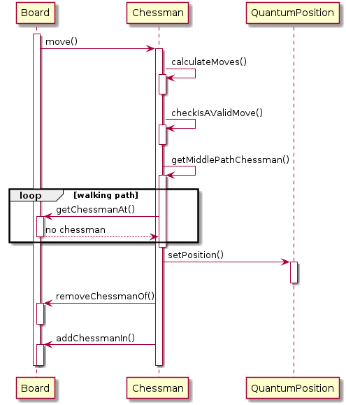

# Quantum Chess: Manual Técnico Server

En este programa, el server es el encargado de conectar a los clientes entre si,
creando partidas y ocupandose de conectar a los clientes a ellas. Además, se
encarga de procesar toda la lógica de juego, quitando esta responsabilidad a los
clientes.

## Ejecucion

## Estructura

Se puede dividir al server en dos grandes estructuras: la de lógica de conexión
y la de la lógica del juego. Ambas interactuan a través de clase ```Board```, la
cual actúa como API para el juego.

A continuación se muestra el diagrama de hilos del Server.


<p align=center>
    
</p>

## Conexión

La estructura de conexión del cliente al server y a una partida se realiza a
través de tres tipos de hilos funcionando en simultáneo. El server posee un
socket en escucha, el cual es creado por el *main thread*, y pasado al *acceptor
thread* (representado por la clase ```AcceptorThread```). El *acceptor thread*
se encarga de aceptar nuevos clientes, creando sus sockets, y pasarlos (por
medio de una cola bloqueante) al *lobby thread* (representado por
clase ```LobbyThread```), el cual, toma estos socket, y se encarga de crear por
cada cliente un *client connection thread* (representado por
clase ```ClientConnectionThread```).

Finalmente el *client connection thread* llamará a la
clase ```MatchesOrganizer```, quien se encarga de unir clientes a partidas, y
crearlas si corresponde, guardandolas en la clase protegida ```MatchesMap```.
Tener un hilo de conexión por cliente, da la ventaja de permitir conectar a
varios clientes a la vez.

Tanto *acceptor thread* como *lobby thread* pasan la mayor parte del tiempo
bloqueados, el primero en un *accept* de un *socket*, y el segundo en el *pop*
de la cola bloqueante de *sockets* que carga el primero.

*Lobby thread*, además, tiene la responsabilidad de hacer *join* a los hilos de
partidas y de conexión de clientes inutilizados.

DIAGRAMA DE SECUENCIA CONEXIÓN

### Organizador de partidas y pseudoprotocolo de conexión

Una vez que el *socket* llega al *client connection thread*, este llama al
método ```addClientToMatchCreatingIfNeeded()``` de la clase ```MatchOrganizer```
. Aquí comienza un ida y vuelta entre el cliente y el server donde se
intercambian información. Este intercambio solamente tiene un pseudoprotocolo
muy básico. A diferencia del intercambio de datos producido durante la partida,
en este caso es secuencial, por lo que mientras el server envía información, el
cliente recibe y viceversa.

Primeramente, el server envía la información sobre las partidas (ids, quienes
están jugando, cuáles son sus roles). Luego, el cliente responde con un número
de 16 bits, el cual puede significar:

* 0: creación de nueva partida.
* 1 a 65534: id de la partida a la que se desea conectar.
* 65535: refresh, se solicita enviar la información de partidas nuevamente.

Una vez enviada una partida. El mando pasa al objeto ```Match``` mediante el
método ```addNewClient()```. El cliente envía su nombre, para ello, se envía
previamente un número de 16 bits indicando la cantidad de caracteres.

Luego, el server envía los roles que están disponibles, para ello, se envía la
cantidad de roles que se van a enviar y luego se envían sus ids
correspondientes (0: blancas, 1:negras, 2:espectador). Finalmente el cliente
envía el rol seleccionado y este es validado por el server. El cliente ya se
encuentra en la partida.

Se muestra en la Figura un diagrama de la comunicación realizada, para el caso
en que se selecciona una partida ya creada previamente.

<p align=center>
    
</p>

## Partidas y clientes

### Clientes

La comunicaciones con los clientes son manejadas por la
clase ```ClientHandler```, la cual, maneja a su vez dos clases que representan a
dos hilos: ```ClientHandlersReceiver``` y ```ClientHandlersSender```. La primera
de ella se encarga de recibir datos por el socket del cliente (y pushearlos a
una cola bloqueante) y la segunda de enviar datos por el socket del clientes (
popeados desde una cola también bloqueante).

Cada cliente posee una estructura de datos llamada ```ClientData```, donde se
encuentra toda la información que el server debe conocer sobre cada cliente,
estos datos son:

* Id: un número asignado incrementalmente por el *lobby thread* al crear al
  cliente, es único e irrepetible.
* Name: nombre elegido por el cliente al conectarse y que se mostrará (junto con
  el id) a los demás clientes (puede repetirse entre jugadores).
* Rol: identificador del rol del jugador, puede representar: blancas, negras o
  espectador. Este último es el único que puede repetirse.

### Partidas

Las partidas son representadas por la clase ```Match```, la cual representa es a
su vez un hilo, donde corre cada partida, por lo que cada partida corre
absolutamente por su cuenta. Cada partida tiene una cola bloqueante de *updates*
, la cual es revisada constantemente por este hilo. Allí llegan las distintas
instrucciones, que luego se ejecutará en la lógica del juego, y de ser
necesario, notificará a los distintos clientes que corresponda.

Cada partida almacena sus clientes en una clase protegida
llamada ```ClientsMap```, la cual almacena, tanto a los distintos *client
handlers* como a las llamdas ```listening queues``` (las cuales son colas
bloqueantes). Cuando el server desea enviar un mensaje a uno (o a más) clientes,
pushea el mensaje a la cola correspondiente (utilizando como clave el id) del
cliente.

### Instrucciones

Las instrucciones tienen la particularidad de ser "ambiguas", se utiliza una
sola estructura de instrucción tanto para recibidas como para enviadas, habiendo
algunas que hacen una de las dos y otras que hacen ambas. Las instrucciones (
representadas por la clase abstracta ```Instruction```), tienen dos métodos
principales: ```makeActionAndNotify()``` y ```fillPacketWithInstruction()```. La
primera, es la acción ejecutada por el *match thread* cuando la recibe, este
método podría contener una acción o estar vacio (siendo el caso por ejemplo de
una instrucción que sea solo de salida). Una instrucción podría tener como
acción replicarse a si misma a los demás clientes (como la de chat). La segunda
simplemente llama (si fuera una instrucción que se puede enviar) al método del
protocolo que se encarga de llenar un paquete con su información.

Las instrucciones pueden tener distintos atributos dependiendo de sus
necesidades.

Se pueden destacar distintos tipos de instrucciones:

* De carga de tablero (```LoadBoardInstruction```): contienen toda la
  información de las piezas en el tablero, tales como posicion, el tipo de
  pieza, el color y la probabilidad. Esta instrucción es enviada cuando se
  comienza la partida, cada vez que se conecta un cliente y luego de realizar
  una acción que modifique el tablero. Se envia a todos los clientes.

* De accion sobre el tablero: contienen una acción que produce una modificación
  en el tablero, por ejemplo una de movimiento o de *split*. Estas solamente
  pueden llegar y producen como respuesta una instrucción de carga de tablero,
  de sonido, se log, entre otras.

* De requerimento de información: se reciben como *requests* de información de
  movimiento, de *splits*, de entrelazamientos, etc. La acción de estas
  instrucciones consiste en pedir información al juego, y devolver la misma
  instrucción con la información pertinente. Se envía al cliente que pidió la
  información.

* De chat: contienen mensajes de chat. Cada cliente envia simplemente el
  mensaje. Su acción consiste en agregar el nombre del cliente del que se
  recibió, agregar un *timestamp*, y replicarse a si misma a todos los clientes.

* De log: contienen mensajes de información sobre el juego, como errores,
  historiales, etc. Solo se envían, a todos o a algún cliente en especial
  dependiendo el tipo de log.

* De salida: es lo último que envia un cliente antes de cerrarse, se encarga de
  eliminar el cliente de la partida y de notificar con un mensaje de chat ('
  proveniente' del cliente eliminado) de que el cliente se fue.

* De excepcion de ajedrez: un mensaje de error que se replica en el log de
  errores conteniendo algun problema que haya ocurrido en el movimiento del
  cliente.

* De sonido: envia una señal al cliente de que debe producir un sonido (por
  ejemplo luego de una captura).

## Protocolo

El protocolo de comunicación utilizado es muy básico. Cada instrucción comienza
con un caracter ascii (simplemente una letra) representado por un ```char```.
Luego cada instrucción tiene una estructura distinta dependiendo de la
necesidad.

Se mantienen a lo largo de todas las instrucciones las siguientes convenciones:

* Los valores numéricos enteros de 2 bytes o mas son enviados en formato *big
  endian*.
* Las cadenas de texto son precedidas por 2 bytes conteniendo el largo de la
  cadena.
* Los valores de tipo ```double```, utilizados particularmente para el envío de
  probabilidades de las piezas cuánticas, son enviados en dos bytes en *big
  endian*. Esto permite una precisión de $1/2^{16}$. Como no interesa el valor
  de probabilidad 0, se tiene que el numero 0 mapea a $1/2^{16}$ y el número
  UINT16_MAX (65536) mapea a 1. Por lo tanto, las ecuaciones para hacer la
  codificación y la decodificación, son, respectivamente:

  <p align=center>
    
  </p>
   <p align=center>
    
  </p>

### Ejemplo con instrucción de carga

Como ejemplo, se muestra la estructura de la instrucción ```LoadBoard```,
encargada de llevar la información del tablero. Se envía primeramente la
letra ```l```, y luego se envía un numero de 1 byte indicando la cantidad de
piezas que se enviarán. Para cada pieza, se envía un ```char``` indicando la
pieza, luego se envía un byte representando un booleano que indica si la pieza
es blanca o no. Luego se envian dos numeros de 1 byte representando las
coordenadas $x$ e $y$ respectivamente. Finalmente, se manda el ```double``` de
la forma descripta en la sección anterior. Finalmente, el mensaje se ve de la
siguiente manera:

    l  <amount> <<chessman id> <isWhite> <x> <y> <probability>>

por ejemplo, si se quisiera enviar información de un caballo blanco al 50% en la
posicion A3 y una torre negra en la posicion B8 al 100%, se enviaría (en
binario)

    76(l) 02 48(H) 1(true) 00 02 7F FF (32767=0.5) 54(T) 0(false) 01 07 FF FF(65535=1)

## Lógica del Quantum Chess

La estructura del juego se encuentra separada del resto del server. Se comunican
a través de la API ofrecida por la clase ```Board```, la cual representa al
tablero y sobre la que se pueden ejercer distintos movimientos como pedidos de
información.

<p align=center>
    
</p>

### Tablero

La clase ```Board```, como se dijo anteriormente, representa al tablero,
contiene primeramente un vector con todas las piezas existentes en el tablero (
incluso las capturadas), debido al uso de polimorfismo para las piezas, estas
son almacendas utilizando *smart pointers*.

Luego, como estructura utilizada para la lógica contiene un *map*, donde la
clave es la posición y el valor un puntero a la pieza que esté allí. De esta
manera se tiene facil acceso a cada pieza del tablero.

El tablero posee métodos para ejercer movimientos, tales como: ```move()```
, ```split()``` y ```merge()```; para obtener información, tales
como ```getEntangledOf()```, ```getPossibleMovesOf()```, etcétera; y métodos de
carga como ```load()```, que permite cargar un tablero desde un archivo de
texto (explicado en el manual de usuario).

### Position y QuantumPosition

Las posiciones son representadas por la clase ```Position```, la cual contiene
las coordenadas en x e y.

Las posiciones cuánticas, son representadas por la clase ```QuantumPosition```.
Estas contienen un objeto ```Position```, la probabilidad correspondiente a la
posición y un puntero a su ```Chessman```, si lo tuviera.

### Chessman

La clase ```Chessman``` es una clase abstracta que representa a cada pieza de
ajedrez del tablero. Posee una referencia al tablero al que pertenece, ya que
debe efectuar acciones sobre este, una lista de las posiciones en las que se
encuentra (```QuantumPosition```), y un ```bool``` indicando su color. Además
posee una referencia a un ```EntanglementLog``` conteniendo todos los
entrelazamientos que existen en el tablero.

Los distintos comportamientos de las distintas piezas se implementan mediante
polimorfismo, en el diagrama se puede ver los distintos métodos que implementan.
Por ejemplo, el peón implementa nuevamente ```move()``` ya que debe setear su
flag de primer movimiento en ```false```.

<p align=center>
    
</p>

### Validación de movimientos

Los posibles movimientos de cada pieza es resuelto utilizando polimorfismo. Cada
clase hija de ```Chessman``` posee un método ```calculateMoves()```, la cual
devuelve una lista, conteniendo todos los posibles movimientos que puede hacer
una pieza. Esto es 'crudo', es decir, no se consideran aspecto como piezas
ocupando el camino, simplemente se limita a ver que movimiento puede hacer una
pieza.

Luego, se valida que el movimiento (o split, etc) sea valido considerando el
resto del tablero (que el camino este libre de piezas clásicas, que la pieza del
casillero final sea cuántica o del equipo contrario, etc). Esto se hace a través
de funciones como ```calculatePossibleMoves()```, la cual devuelve una lista
filtrada con los movimientos posibles.

Esta función utiliza otras dos tales como ```getChessmanInPath()```
y ```checkFreePath```, las cuales calculan los casilleros por los que debe ir
una pieza para llegar a su destino, y devuelve las piezas que se encuentre en el
o si es posible realizarlo.

Validaciones extras tales como el enroque para el rey o el primer movimiento o
la captura del peón son validadas en cada clase particular utilizando, de nuevo,
polimorfismo.

### Movimiento y captura

La lógica de los movimientos es simple, siempre que se mantengan las piezas en
estado clásico, para *measure* y entrelazamientos ver las secciones siguientes.
El movimiento consiste en chequear que el movimiento sea valido, y luego cambiar
la posición de la pieza tanto en ella misma (en la posición que corresponda) y
luego actualizar el tablero quitando la pieza del lugar que ocupaba antes,
agregandola en la nueva posición (actualizando el *map* perteneciente a la
clase ```Board```).

Si existiese una pieza del equipo contrario en la posición final, esta será
quitada de esa posición y reemplazada por la nueva pieza.

<p align=center>
    
</p>

### Piezas cuánticas, lista de posiciones, *split* y *merge*

En el movimiento *split*, una pieza se parte de dos en dos, pasando a estar en
un estado "cuántico" donde la posición real de la pieza no está definida. Cuando
se realice un *measure*, se definirá la posición real de la pieza.

Si bien esto es así en la "teoría" del juego, la implementación real define que
posición tiene la pieza al momento de realizar el *split*. Cuando este se
realiza, se sortea una moneda utilizado la clase ```PseudoRandomCoin```,
decidiendo así que posición de las dos elegidas es la real.

Las distintas posiciones que puede tener una pieza al mismo tiempo, se
representan mediante una lista de ```QuantumPosition```. Esta lista posee la
única particularidad de que se mantiene siempre en la primera posición de la
lista se encuentra la verdadera.

De esta manera, cuando se realiza un movimiento simple, se actualiza
directamente la posición que se modificó.

Cuando se hace un *split*, se sortea entonces cual es la posición verdadera (
incluso aunque la original no lo fuera). Esta reemplaza a la antigua posición, y
se agrega seguidamente la nueva. Ambas con la probabilidad de la antigua a la
mitad. Realizando esto, si la antigua posición era la verdadera, la que sale
sorteada verdadera en el *split* queda como verdadera absoluta.

El caso contrario, el *merge*, se realiza sumando las probabilidades de las dos
posiciones iniciales. Luego, si, alguna de las dos es la verdadera, se actualiza
allí la nueva posicion, y se elimina la otra. Si ninguna de las dos es la
verdadera, se coloca en la primera de las dos (lo cual, se hace por comodidad ya
que no tiene importancia).

### Entrelazado y medicion

Para la resolución del entrelazado, entre varias opciones, se optó por el uso de
un log de entrelazamientos, la clase ```EntanglementLog```. Esta clase lleva
nota de todos los entrelazamientos que existen. Para ello, guarda en cada
anotación dos ```QuantumPosition```, las dos entrelazadas. Se estableció como
regla que solo se puede entrelazar de una pieza a la vez y no más de una vez dos
piezas. Cuando se mide una pieza, todas las piezas que dependan de ella deberían
medirse tambien, aunque no siempre es una relación directa. Al entrelazar, se
decide que pieza es la verdadera de la que se parte, según si la que se
encuentra en medio del camino es la verdadera de la otra pieza.

Cuando se mide una pieza, pueden ocurrir dos situaciones:

* La pieza está allí, con lo que todas las demás posiciones se descartan.
* La pieza no está allí, con lo que se deben propagar las probabilidades de las
  demás y contemplar ciertos casos con los entrelazamientos.

Cabe aclarar, que solo se entrelazan las posiciones que interactuan en el
movimiento (es decir, la pieza que se mueve y la que se encuentre en el medio
del camino).

Cuando se mide una pieza, se miden a su vez todas las piezas que dependan de
ella, dependiendo de ciertas condiciones, por ejemplo:

* Si la pieza no está allí, pero por ejemplo hay otra posición de la pieza que
  sigue entrelazada con la otra, entonces la otra no debe ser medida.
* Si una pieza que se mide no está entrelazada con otra pieza, pero todas las
  demás si estaban entrelazada con ella, se debería medir igualmente la otra
  pieza.

Todos estos casos son responsabilidad de ```EntanglementLog``` y están
contemplados en ella.

<p align=center>
    
</p>

### Generador de números aleatorios

Se utiliza como generador de números aleatorios la clase ```PseudoRandomCoin```,
la cual posee un único metodo llamado ```flip()```, el cual devuelve un
booleano ```true``` o ```false``` con probabilidad 50% (comprobado mediante los
tests correspondientes).

Esta clase es implementada utilizando un generador pseudo aleatorio de tipo *
mersenne twister engine* de 64 bits. Se obtiene el número de 64 bits, y luego se
le realiza modulo 2 para obtener el booleano.
   <p align=center>
    
  </p>


### Tests

Los comportamientos del juego fueron chequeados mediante tests utilizando el
framework de ```Google Test``` y ejecutados utilizand ```valgrind```. Se puede
encontrar como correr los tests en el manual de usuario.

