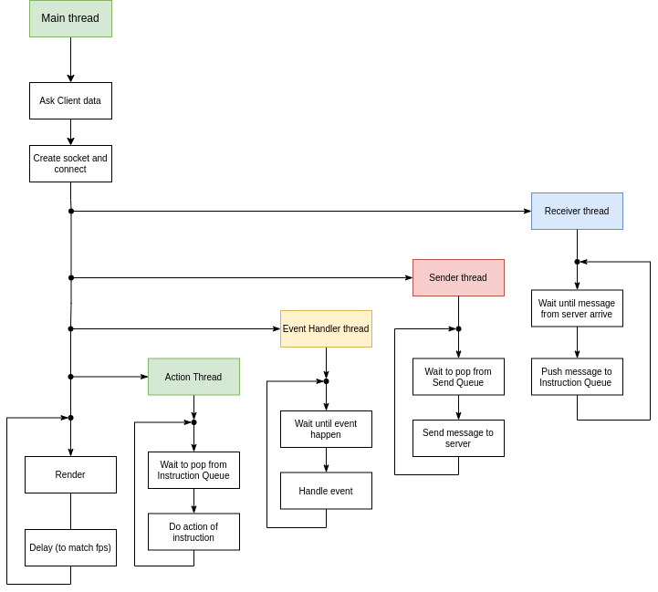

# Quantum Chess: Manual Técnico

## Diagrama de hilos

### Server

A continuaciṕon se muestra el diagrama de hilos del server. Se detallan más adelante el trabajo principal de cada hilo.

    

* **Hilo principal** (main thread): simplemente lanza el hilo aceptador y queda a la espera de una entrada de texto por standard input que le indique la finalización del programa.

* **Hilo aceptador** (acceptor thread): lanza el hilo de lobby y queda a la espera de que un cliente se conecte a su socket en escucha, una vez que recibe la conexión, pushea el socket del cliente a una cola bloqueante que es esperada por el hilo de lobby.

* **Hilo de lobby** (lobby thread): este hilo pasa la mayor parte del tiempo bloqueado en un pop de la cola bloqueante de sockets de clientes nuevos (que carga el hilo aceptador). Cuando un nuevo socket de cliente llega, este hilo se encarga de preguntarle a que partida quiere conectarse e información al cliente. Luego, si la partida no existe, se crea. Y luego, existiese o no la partida, se crea un nuevo cliente (lanzandose sus hilos recibidor y enviador), y se agrega a la partida correspondiente.

* **Hilo de partida** (match thread): existe un hilo de este tipo por cada partida existente. Este hilo pasa la mayor parte del tiempo esperando que se ingrese una instrucción a la cola bloqueante de updates. Cuando llega una instrucción, se ejecuta, y de ser necesario se pushea un mensaje a la cola de salida de los distintos clientes (podría ser a todos o a uno, depende de la instrucción).

* **Hilo recibidor** (receiver thread): existe uno por cada cliente. Se encarga de esperar que llegue un mensaje de su cliente, y lo pushea a la cola bloqueante de update del match thread.

* **Hilo enviador** (sender thread): existe uno por cada cliente. Pasa la mayoria del tiempo bloqueado esperando a que el match thread pushee algo a la cola de envios. Cuando algo aparece lo envia por su socket conectado al cliente.

### Cliente

A continuaciṕon se muestra el diagrama de hilos del cliente. Se detallan más adelante el trabajo principal de cada hilo.

    

* **Hilo principal** (main thread): se encarga de preguntar información al usuario (tal como host, port, nombre, etc). Luego con esta información, crea el socket, se conecta al server intercambiando la información necesaria. Luego lanza los cuatro hilos restantes del programa. Finalmente se encarga de la renderización de la interfaz gráfica.

* **Hilo recibidor** (receiver thread): se encarga de recibir mensajes desde el server, estando bloqueado allí, y pushearlos a la cola de instrucciones para el action thread.

* **Hilo enviador** (sender thread): está bloqueado en el pop de la cola de envios y envia al server cuando haya algo que enviar.

* **Hilo de acción** (action thread): esta bloqueado esperando que haya algo en la cola de instrucciones y cuando algo ocurre, realiza la acción.

* **Hilo manejador de eventos** (event handler thread): esta bloqueado esperando que ocurra un evento, cuando esto pasa, lo maneja y ejecuta la acción correspondiente.